# Fuljo Ingesta PowerApps - Trigger DataBricks (Minerva CdG Evolution 2.0)

> **Documento único canónico** — ingesta desde Power App hasta trigger Databricks vía ADF.
> 
> 
> Audiencia: negocio, UAT, soporte funcional y equipo técnico.
> 

---

## Índice de bloques

| Bloque | Título |
| --- | --- |
| 0 | Metadatos y alcance |
| 1 | Accesos y ubicaciones UAT |
| 2 | Cómo funciona la solución |
| 3 | Configuración y prerequisitos |
| 4 | Power App |
| 5 | Power Automate (diagramas detallados) |
| 6 | Flujos de negocio (4 escenarios) |
| 7 | Azure Data Factory (pipelines ADF) |
| 8 | Matriz de parámetros E2E |
| 9 | Errores frecuentes y soporte |
| 10 | Artefactos en repositorio |
| 11 | Deuda técnica conocida |

---

## BLOQUE 0 — Metadatos y alcance

### Para negocio

Esta guía describe cómo cargar **plantillas Excel** y **tablas maestro** en Minerva usando la app de ingesta, SharePoint y los procesos automáticos en Azure.

### Alcance

| Incluido | Excluido |
| --- | --- |
| Power App, Power Automate, SharePoint | Procesamiento Bronze (notebooks Databricks) |
| ADF `MINERVA_Main_pipeline` y sub-pipelines | Detalle interno del job Load Engine |
| Wrapper ADF → `jobs/run-now` Databricks | `Transformation_Engine` (inactivo en preUAT) |

### Glosario

| Término | Significado |
| --- | --- |
| **Plantilla** | Excel de informe en `Plantillas de información` |
| **Maestro** | Tabla de referencia en listas SharePoint |
| **Procesados** | Carpeta en *Documentos Consolidados* donde PA archiva copia + metadatos |
| **origen** | `PLANTILLA` o `MAESTRO` — bifurca en PA (`Condition_3`) y en ADF |
| **accion** | `PROCESS`, `REPROCESS` o `DELETE` (solo rama plantilla) |

---

## BLOQUE 1 — Accesos y ubicaciones UAT

### Para negocio

Aquí están los enlaces directos a la app, las bibliotecas SharePoint y las listas de configuración. Guárdalos como favoritos para el día a día de UAT.

### Accesos principales

| Recurso | URL | Qué es | Nombre técnico / ruta |
| --- | --- | --- | --- |
| **PowerApp de Ingesta** | [Abrir app UAT](https://apps.powerapps.com/play/e/default-495d03db-f910-4fcf-9e4c-2cab5fb10e56/a/219fddb2-851a-47b9-a4c7-92dce5697ced?tenantId=495d03db-f910-4fcf-9e4c-2cab5fb10e56) | App publicada para usuarios | Canvas *Minerva — Gestión de Cargas* |
| **SharePoint de Carga** | [Documentos compartidos](https://cemolins.sharepoint.com/sites/MinervaCdG2.0-Test/Documentos%20compartidos/Forms/AllItems.aspx) | Biblioteca de trabajo | Carpeta **`Plantillas de información/{sociedad}/{ano}/{mes}/{concepto}`** |
| **SharePoint Consolidado / Histórico** | [Documentos Consolidados](https://cemolins.sharepoint.com/sites/MinervaCdG2.0-Test/Documentos%20Consolidados/Forms/Agrupado%20Periodo%20%20Area.aspx) | Archivo procesado | Carpeta **`Procesados/...`** (copia PA, rama PLANTILLA) |
| **Gestión de Cierre de Periodos** | [Cierre Periodos](https://cemolins.sharepoint.com/sites/MinervaCdG2.0-Test/Lists/Cierre%20Periodos/AllItems.aspx) | Lista de conceptos/plantillas | Alimenta desplegable concepto (`IdPlantilla`, `Plantilla`, `Periodo`) |
| **Gestión de Permisos de Procesado** | [MinervaPermisos](https://cemolins.sharepoint.com/sites/MinervaCdG2.0-Test/Lists/Test2/AllItems.aspx) | Lista de permisos UAT | En la app: conector **`MinervaPermisos`** (ver nota abajo) |

### Infraestructura técnica (referencia)

| Recurso | Ubicación |
| --- | --- |
| Sitio SharePoint base | `https://cemolins.sharepoint.com/sites/MinervaCdG2.0-Test` |
| Power Automate | Flujo `PowerAppV2 -> HTTP` (ID `9388b670-a748-405c-bec8-b8efc5b60cd5`) |
| Azure Data Factory | `datafactory-minerva-dev-002` / `rg-Minerva-dev-02` · pipeline `MINERVA_Main_pipeline` |
| ADLS landing | `storageminervadev002` / contenedor `refactoring-minerva-001` |
| Export PA en repo | [`PowerAutomate/PowerAppV2-HTTP_preUAT/`](../PowerAutomate/PowerAppV2-HTTP_preUAT/) |

### Mapa de relaciones

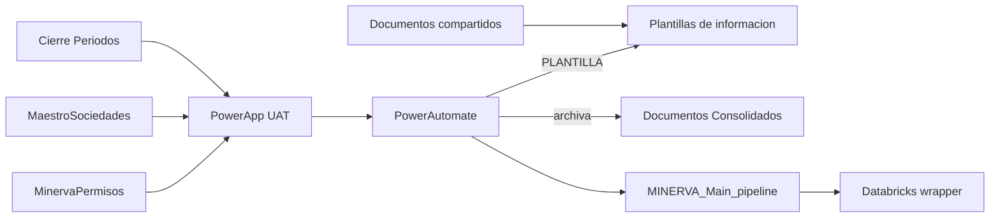

---

## BLOQUE 2 — Cómo funciona la solución

### Para negocio

Abres la app, eliges sociedad, año, mes y concepto, y pulsas un botón:

| Botón | Efecto |
| --- | --- |
| **Procesar** | Primera carga de la plantilla del periodo |
| **Reprocesar** | Vuelve a cargar tras corregir el Excel |
| **Borrar** | Elimina datos del periodo en el almacén (no borra el Excel en SP) |
| **Actualizar Maestros** | Actualiza tablas maestro desde listas SharePoint |

Power Automate valida el Excel **solo** en operaciones de plantilla. Para maestros, lanza Azure directamente.

### Swimlane global

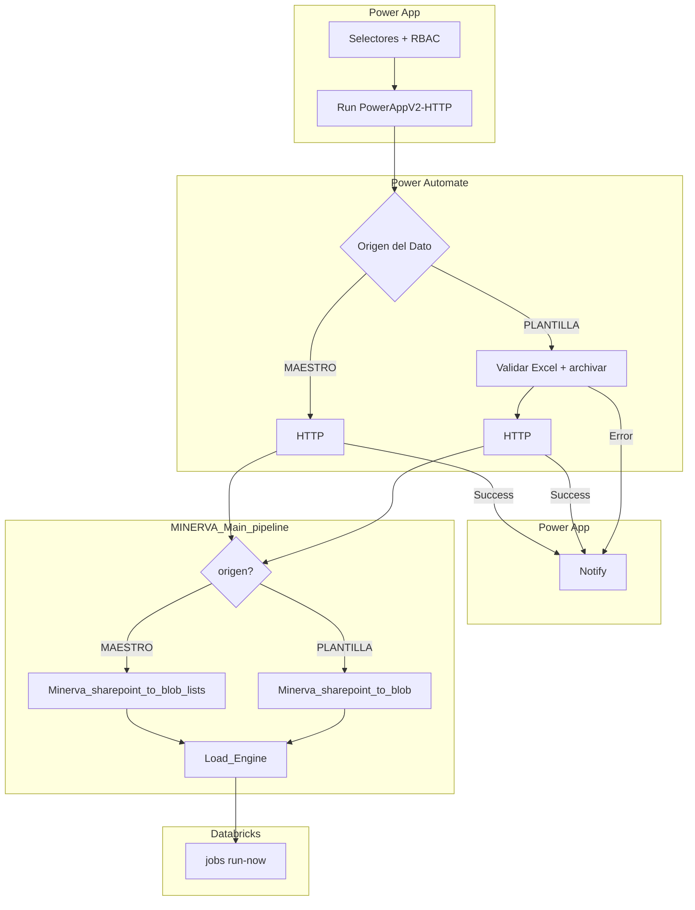

### Narrativa del recorrido completo

Imagina que un usuario de finanzas quiere cargar el P&L de junio de CMSA:

1. **App:** abre la Power App UAT, elige región/país/sociedad, año `2026`, mes `06`, concepto `PL` y pulsa **Procesar**. La app comprueba permisos en la lista de permisos y que los cuatro desplegables están rellenos.
2. **Power Automate:** recibe ocho parámetros. Como `origen=PLANTILLA`, entra en la rama larga: busca el Excel en SharePoint, exige que haya exactamente uno, lo copia a *Procesados* con metadatos y llama a ADF.
3. **ADF orquestador:** valida parámetros, ejecuta el sub-pipeline de plantillas (lee el mismo Excel desde `Plantillas de información` y lo deja en ADLS) y construye un JSON con la ruta del blob.
4. **ADF wrapper:** dispara el job Databricks Load Engine con ese JSON.
5. **App:** muestra notificación verde con el mensaje devuelto por Power Automate.

Si el mismo usuario pulsa **Actualizar Maestros**, los pasos 2 y 3 cambian: Power Automate **no toca SharePoint** y ADF ingiere las diez listas maestro en lugar del Excel.

### Secuencia temporal global

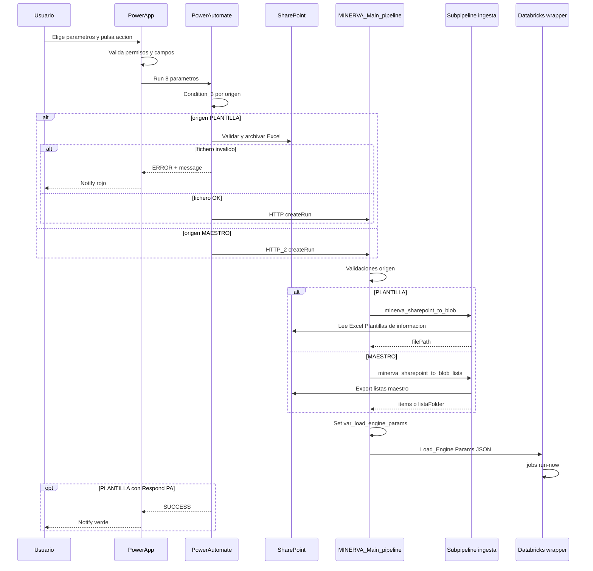

---

## BLOQUE 3 — Configuración y prerequisitos

### Permisos de usuario (lista Test2 / MinervaPermisos)

1. Abrir [Gestión de Permisos](https://cemolins.sharepoint.com/sites/MinervaCdG2.0-Test/Lists/Test2/AllItems.aspx).
2. Crear fila con **Title** = email del usuario (ej. `usuario@molins.es`).
3. En columna de acción, asignar uno o más valores:

| Valor en lista | Botón en app |
| --- | --- |
| `Procesar` | Procesar |
| `Reprocesar` | Reprocesar |
| `Borrar` | Borrar |
| `ActualizarMaestros` | Actualizar Maestros |

Sin fila → botones en gris (`DisplayMode.Disabled`).

### Preparación SharePoint (solo PLANTILLA)

En [SharePoint de Carga](https://cemolins.sharepoint.com/sites/MinervaCdG2.0-Test/Documentos%20compartidos/Forms/AllItems.aspx), ruta:

`Plantillas de información / {sociedad} / {ano} / {mes} / {concepto} /`

Debe haber **exactamente un** fichero `.xlsx`.

### Importación y publicación de la app

1. [Power Apps](https://make.powerapps.com/) → Import → [`ADF File Processing App_preUAT.msapp`](../PowerApps/ADF%20File%20Processing%20App_preUAT.msapp).
2. Reconfigurar conexiones: SharePoint (listas y bibliotecas), Databricks (`log_table_execution`), flujo `PowerAppV2->HTTP`.
3. Publicar y compartir con grupo UAT.
4. Probar los cuatro botones.

### Quién configura qué

| Rol | Componente | Acción |
| --- | --- | --- |
| Admin SharePoint | Test2, Cierre Periodos, bibliotecas | Permisos y estructura carpetas |
| Admin Power Platform | Canvas app + flujo PA | Import, conexiones, publicación |
| Admin ADF | Factory, pipelines, global parameters | Despliegue JSON preUAT |
| Admin Databricks | Job Load Engine ID | Alinear `LoadEngineJobId` en main |

---

## BLOQUE 4 — Power App

### Para negocio

Pantalla **Minerva — Gestión de Cargas**: desplegables en cascada (región → país → sociedad → año → mes → concepto) y cuatro botones de acción. El panel muestra estado de la última ejecución.

### Detalle técnico

| Propiedad | Valor |
| --- | --- |
| Artefacto repo | [`ADF File Processing App_preUAT.msapp`](../PowerApps/ADF%20File%20Processing%20App_preUAT.msapp) |
| App publicada UAT | Ver [BLOQUE 1](#bloque-1-accesos-y-ubicaciones-uat) |
| Pantalla principal | `Gestión_Cargas` (1366×768) |
| Flujo invocado | `PowerAppV2->HTTP` |

### Matriz botón → parámetros

| Botón | `accion` | `origen` | Rama PA |
| --- | --- | --- | --- |
| Procesar | `PROCESS` | `PLANTILLA` | SharePoint + HTTP |
| Reprocesar | `REPROCESS` | `PLANTILLA` | SharePoint + HTTP |
| Borrar | `DELETE` | `PLANTILLA` | SharePoint + HTTP |
| Actualizar Maestros | `PROCESS` | `MAESTRO` | Solo `HTTP_2` |

### Selectores

| Control | Fuente |
| --- | --- |
| `ddConcepto` | Lista **Cierre Periodos** (excluye `KPI*`) |
| `ddRegion` / `ddPais` / `ddSociedad` | **MaestroSociedades** |
| `ddAno` / `ddMes` | Derivados de `Periodo` en Cierre Periodos |

### Invocación Power Automate (8 parámetros)

```
'PowerAppV2->HTTP'.Run(
    ddSociedad.Selected.Value,
    ddAno.Selected.Value,
    ddMes.Selected.Value,
    ddConcepto.Selected.IdPlantilla,
    "PROCESS",           // o REPROCESS / DELETE
    "PLANTILLA",         // o MAESTRO
    ddConcepto.Selected.Plantilla,
    User().Email
);
```

Tras `Run`, la app evalúa `varFlowResponse.status` y muestra `Notify` (excepto Actualizar Maestros: Notify fijo).

### Panel de estado

| Control | Fuente |
| --- | --- |
| `lblStatus` | Databricks `data_control.log_table_execution` |
| `lblLastExec_1` | Duración ejecución (parcial) |
| `Detalles_Ejecución` | Pantalla WIP — no usar en UAT |

### Diagrama — journey en la pantalla principal

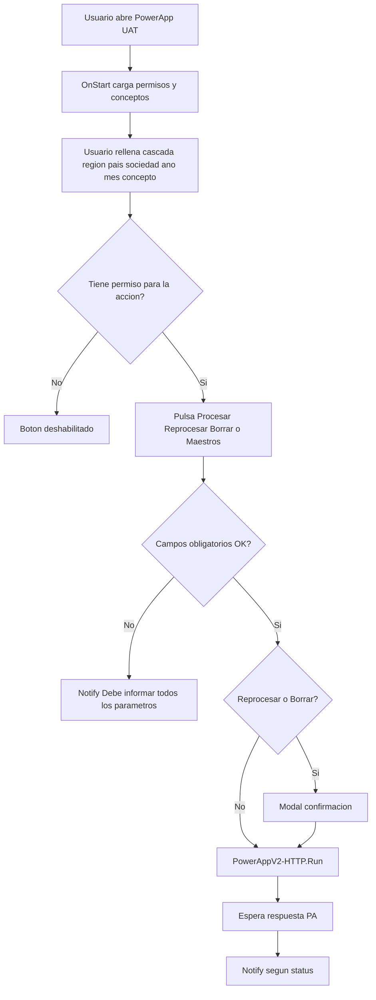

### Narrativa — qué hace la app antes de llamar a Azure

La app **no** copia ficheros ni llama a ADF directamente. Su papel es:

1. **Gobernar quién puede hacer qué** leyendo la lista de permisos al iniciar.
2. **Ofrecer solo combinaciones válidas** de sociedad, periodo y concepto desde listas SharePoint maestras.
3. **Empaquetar la decisión del usuario** en ocho parámetros y delegar en Power Automate.
4. **Traducir la respuesta** del flujo (o un mensaje fijo en Maestros) en una notificación visible.

---

## BLOQUE 5 — Power Automate

### Para negocio

Power Automate es el **intermediario** entre la app y Azure. Cuando pulsas Procesar, Reprocesar o Borrar, primero **comprueba que el Excel está bien puesto** en SharePoint, **deja una copia archivada** con tus datos (sociedad, periodo, usuario) y **entonces** pide a Azure que procese. Cuando pulsas Actualizar Maestros, **salta** esa parte de SharePoint y pide directamente a Azure que actualice las tablas maestro.

| `origen` | Botones | Qué hace PA |
| --- | --- | --- |
| `PLANTILLA` | Procesar, Reprocesar, Borrar | Validar 1 Excel → archivar en *Procesados* → lanzar ADF → responder a la app |
| `MAESTRO` | Actualizar Maestros | Lanzar ADF directamente (`HTTP_2`) |

**Importante:** ADF lee el Excel desde **`Plantillas de información`**, no desde la copia de *Procesados*. La copia es registro documental.

### Identidad del flujo

| Propiedad | Valor |
| --- | --- |
| Nombre | `PowerAppV2 -> HTTP` |
| Flow ID | `9388b670-a748-405c-bec8-b8efc5b60cd5` |
| Export repo | [`PowerAutomate/PowerAppV2-HTTP_preUAT/`](../PowerAutomate/PowerAppV2-HTTP_preUAT/) |
| Factory destino | `datafactory-minerva-dev-002` |
| Pipeline HTTP | `MINERVA_Main_pipeline` |

### Diagrama general — bifurcación por `origen`

La **primera acción** tras el trigger es `Condition_3`: comprueba si el parámetro `origen` (`text_5`) es igual a `"PLANTILLA"`.

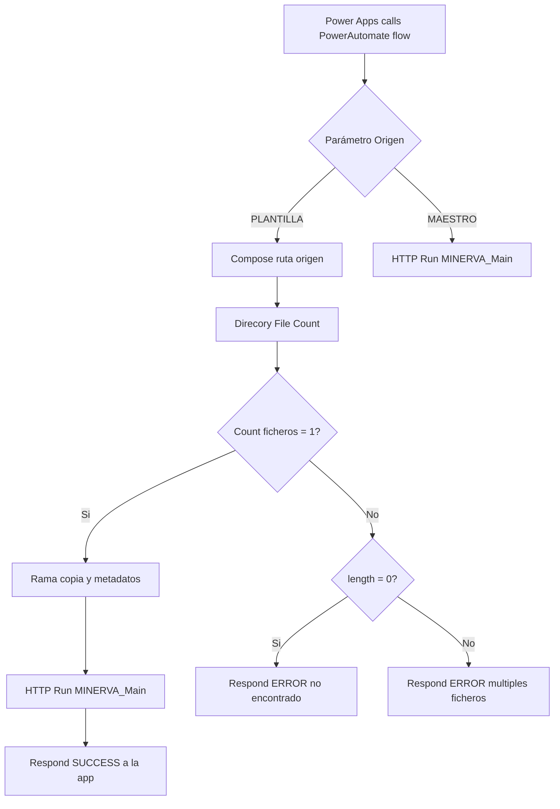

### Diagrama detallado — cuando `origen=PLANTILLA`

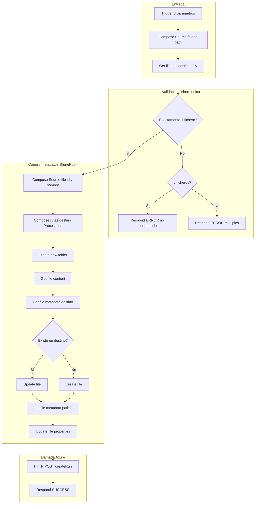

### Rama PLANTILLA

| Paso | Acción PA | Qué ocurre en lenguaje claro |
| --- | --- | --- |
| 1 | **Trigger Power Apps V2** | Llegan sociedad, año, mes, concepto, acción, origen, nombre plantilla y email usuario |
| 2 | **Compose — Source folder** | Se construye la ruta `Plantillas de información/CMSA/2026/06/PL` |
| 3 | **Get files** | SharePoint lista los ficheros de esa carpeta (solo metadatos) |
| 4 | **Condition** | Si hay **un solo** fichero, continúa; si no, va al paso de error |
| 5 | **Condition 2** | Cero ficheros → *“No se ha encontrado ningún fichero…”*; más de uno → *“…más de un fichero…”* |
| 6 | **Compose id/nombre** | Identifica el Excel único a copiar |
| 7 | **Compose rutas destino** | Prepara `Procesados/CMSA/2026/06/PL` en *Documentos Consolidados* |
| 8 | **Create new folder** | Crea la carpeta destino si no existe |
| 9 | **Get file content** | Lee el contenido binario del Excel origen |
| 10 | **Get file metadata** | Comprueba si ya hay un fichero con el mismo nombre en destino |
| 11 | **Update file** o **Create file** | Sobrescribe o crea el Excel en *Procesados* |
| 12 | **Update file properties** | Rellena columnas: Sociedad, Año, Periodo (`06-2026`), Concepto, Usuario |
| 13 | **HTTP** | POST a `.../MINERVA_Main_pipeline/createRun` con sociedad, periodo, concepto, acción y origen |
| 14 | **Respond to Power App** | Devuelve `{ status: SUCCESS, message: "Proceso lanzado correctamente…" }` |

### Diagrama — rama MAESTRO

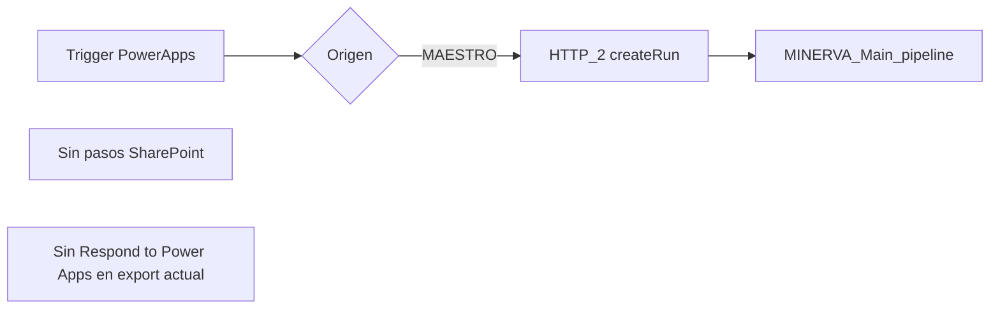

### Rama MAESTRO

1. La app envía `origen=MAESTRO` (botón Actualizar Maestros).
2. `Condition_3` evalúa false → se ejecuta solo **`HTTP_2`**.
3. El body es idéntico al de la rama plantilla (incluye sociedad, periodo, etc., aunque ADF en rama maestro use sobre todo `origen` y `listaNombres` por defecto).
4. **No hay** validación de Excel ni copia a *Procesados*.
5. **No hay** respuesta estructurada a la app; la canvas app muestra un Notify fijo de éxito.

### Secuencia — comparativa PLANTILLA vs MAESTRO

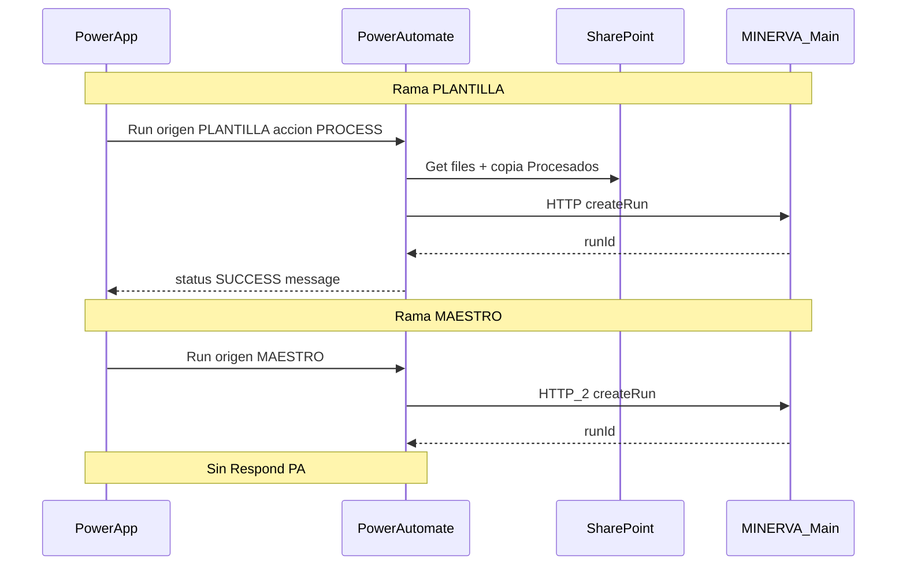

### Rutas SharePoint en Power Automate

| Rol | Ruta | Biblioteca |
| --- | --- | --- |
| Origen lectura PA y ADF | `Plantillas de información/{soc}/{ano}/{mes}/{concepto}/` | Documentos compartidos |
| Destino archivado PA | `Procesados/{soc}/{ano}/{mes}/{concepto}/` | Documentos Consolidados |

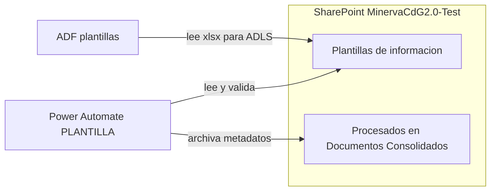

### Contrato HTTP hacia ADF

```json
{
  "sociedad": "CMSA",
  "ano": "2026",
  "mes": "06",
  "concepto": "PL",
  "accion": "PROCESS",
  "origen": "PLANTILLA"
}
```

| Campo PA | Parámetro ADF | Notas |
| --- | --- | --- |
| origen | `origen` | Bifurca main ADF |
| — | `listaNombres` | Default main (10 maestros) si MAESTRO |
| — | `catalog` | Default `dev` |

### Mensajes PA

| Tipo | Texto |
| --- | --- |
| Éxito | *Proceso lanzado correctamente. El fichero se ha copiado y se ha invocado el procesamiento.* |
| Error | *No se ha encontrado ningún fichero…* / *…más de un fichero…* |

---

## BLOQUE 6 — Flujos de negocio

### Antes de pulsar

**PLANTILLA (Procesar / Reprocesar / Borrar):** permiso en MinervaPermisions, procesa Excel en carpeta plantilla.

**MAESTRO (Actualizar Maestros):** permiso ActualizarMaestros.

---

### 6.1 — Procesar

**Para negocio:** primera carga de la plantilla del periodo. Debes tener el Excel en SharePoint antes de pulsar.

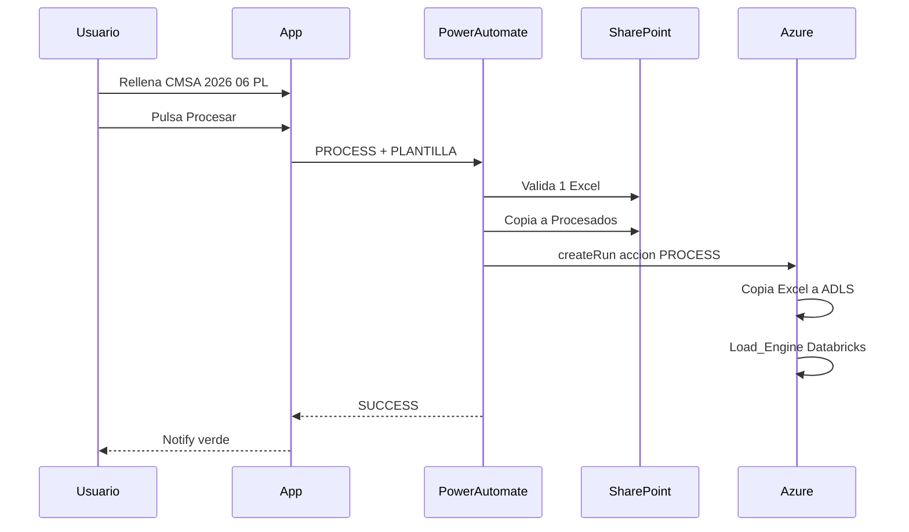

**Narrativa:** Power Automate confirma que el fichero existe y es único, lo archiva con tus metadatos y pide a Azure un **PROCESS**. ADF copia el Excel al landing y arranca el job de carga.

---

### 6.2 — Reprocesar

**Para negocio:** mismo recorrido que Procesar, pero tras corregir el Excel en SharePoint. La app pide confirmación en un modal.

|  | Procesar | Reprocesar |
| --- | --- | --- |
| Confirmación | No | Modal sí |
| `accion` enviada | `PROCESS` | `REPROCESS` |
| Power Automate | Rama PLANTILLA completa | Igual |
| Efecto en ADLS | Sobrescribe activo | Archiva deprecado → borra → recopia |

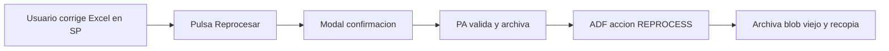

---

### 6.3 — Borrar

**Para negocio:** elimina los datos del periodo en el almacén de datos. **No** borra el Excel de SharePoint. Power Automate **sigue exigiendo** un Excel en la carpeta (misma validación que Procesar).

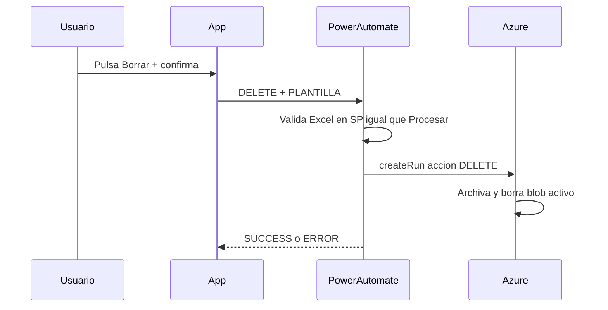

---

### 6.4 — Actualizar Maestros

**Para negocio:** refresca las tablas de referencia (sociedades, productos, monedas, etc.) desde las listas SharePoint. **No necesitas** subir un Excel.

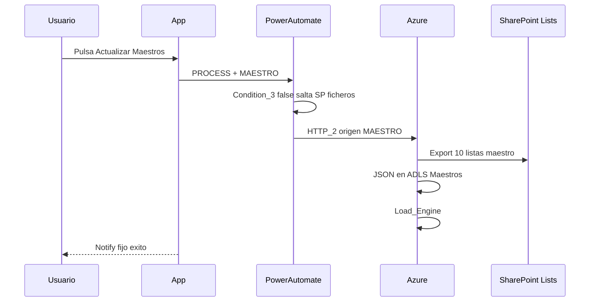

---

### Mensajes al usuario

| Mensaje | Qué hacer |
| --- | --- |
| Verde *Proceso lanzado…* | OK; revisar panel estado |
| Rojo *No se ha encontrado…* | Subir Excel a ruta correcta |
| Rojo *más de un fichero…* | Dejar solo un `.xlsx` |
| *Debe informar todos los parámetros* | Completar desplegables |
| Botón gris | Pedir acceso en Test2/MinervaPermisos |

---

## BLOQUE 7 — Azure Data Factory

### Para negocio

Azure Data Factory es el **motor de integración** en la nube. Recibe la orden desde Power Automate, **copia los datos** desde SharePoint al almacén de ficheros (ADLS) y **lanza el procesamiento** en Databricks. Tú no interactúas con ADF directamente; lo disparas desde la app.

### Vista de pipelines — cómo encajan

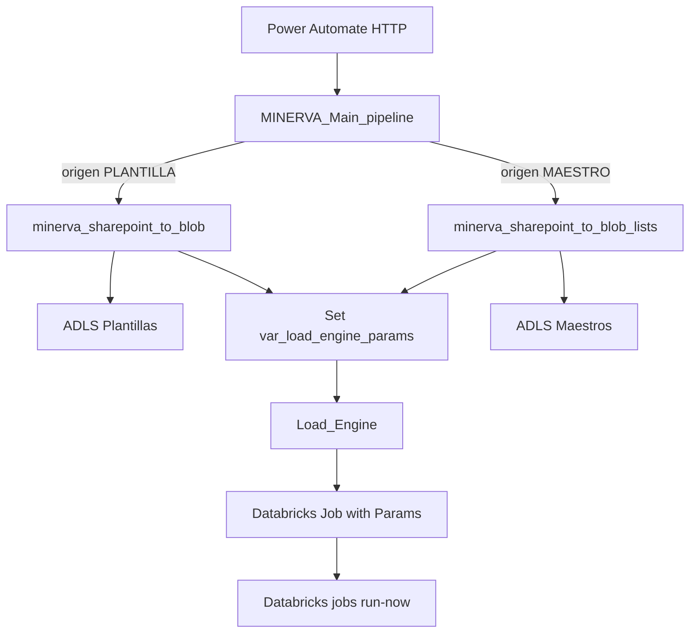

---

### 7.1 — Orquestador `MINERVA_Main_pipeline`

Artefacto: [`0_MINERVA_Main_pipeline_preUAT.json`](../Final_ADF_Pipelines/Orquestración/0_MINERVA_Main_pipeline_preUAT.json)

**Narrativa:** es el **director de orquesta**. No copia ficheros él mismo: valida que los parámetros tienen sentido, delega en el sub-pipeline correcto según `origen`, recoge el resultado (ruta del blob o lista de maestros) y construye un JSON único (`var_load_engine_params`) para el job Databricks.

### Diagrama de validaciones y ramas

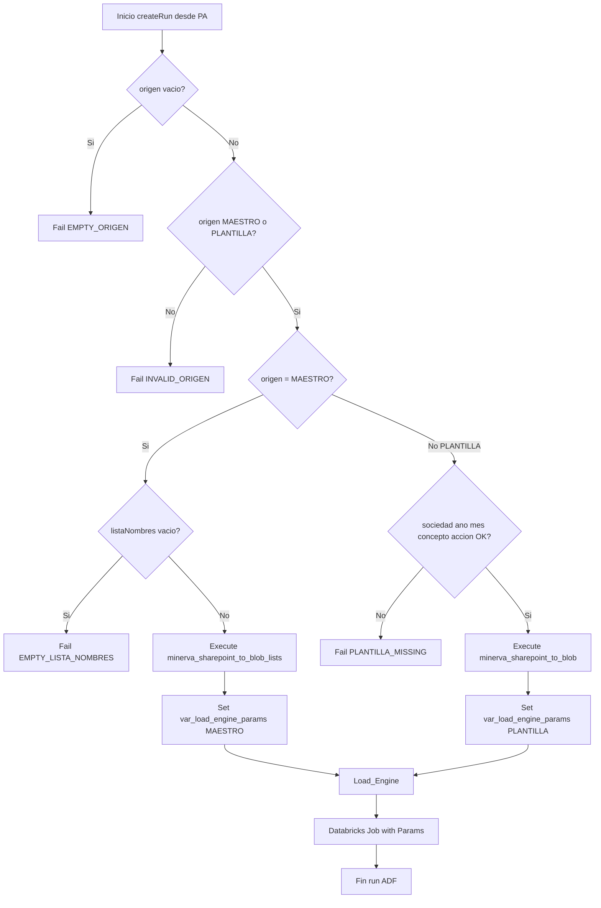

| `origen` | Sub-pipeline | Qué produce |
| --- | --- | --- |
| `PLANTILLA` | `minerva_sharepoint_to_blob` | `filePath` del Excel en ADLS |
| `MAESTRO` | `minerva_sharepoint_to_blob_lists` | Rutas JSON por lista maestro |

**Parámetros clave:** `origen`, `sociedad`, `ano`, `mes`, `concepto`, `accion`, `listaNombres`, `catalog` (default `dev`), `LoadEngineJobId` (default `1097709261114096`).

**Errores:** `EMPTY_ORIGEN`, `INVALID_ORIGEN`, `EMPTY_LISTA_NOMBRES`, parámetros PLANTILLA incompletos.

---

### 7.2 — Plantillas Excel (`minerva_sharepoint_to_blob`)

Artefacto: [`minerva_sharepoint_to_blob_preUAT.json`](../Final_ADF_Pipelines/Plantillas/minerva_sharepoint_to_blob_preUAT.json)

**Narrativa:** este pipeline **lee el Excel desde SharePoint** (carpeta `Plantillas de información`, la misma que validó Power Automate) y lo **deja en ADLS** bajo `refactoring-minerva-001/Plantillas/`. La acción (`PROCESS`, `REPROCESS`, `DELETE`) define si copia, recopia tras archivar o solo borra en el almacén.

### Diagrama por acción

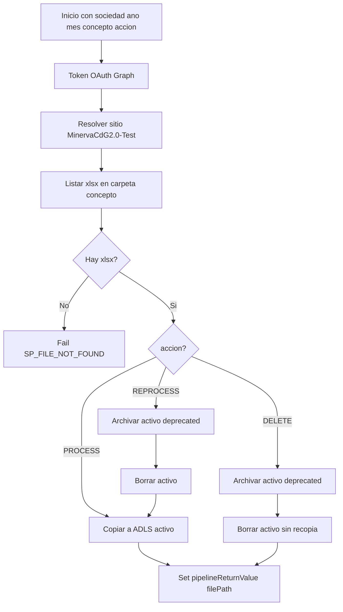

| `accion` | Efecto en ADLS |
| --- | --- |
| `PROCESS` | Copia / sobrescribe blob activo |
| `REPROCESS` | Renombra activo a `_deprecated_on_{timestamp}` → borra → recopia desde SP |
| `DELETE` | Renombra activo a deprecado → borra (sin recopia) |

**Rutas:**

- **Origen SP:** `Plantillas de información/{sociedad}/{ano}/{mes}/{concepto}/`
- **Destino ADLS:** `refactoring-minerva-001/Plantillas/{sociedad}_{concepto}_{ano}_{mes}_{base}.xlsx`

---

### 7.3 — Maestros listas (`minerva_sharepoint_to_blob_lists`)

Artefacto: [`pl_minerva_sharepoint_to_blob_lists_preUAT.json`](../Final_ADF_Pipelines/Maestros/pl_minerva_sharepoint_to_blob_lists_preUAT.json)

**Narrativa:** cuando `origen=MAESTRO`, este pipeline exporta **cada lista SharePoint** del array `listaNombres` (diez por defecto) a ficheros JSON en ADLS. Por cada maestro genera el JSON de datos y el JSON de columnas.

### Diagrama ForEach listas

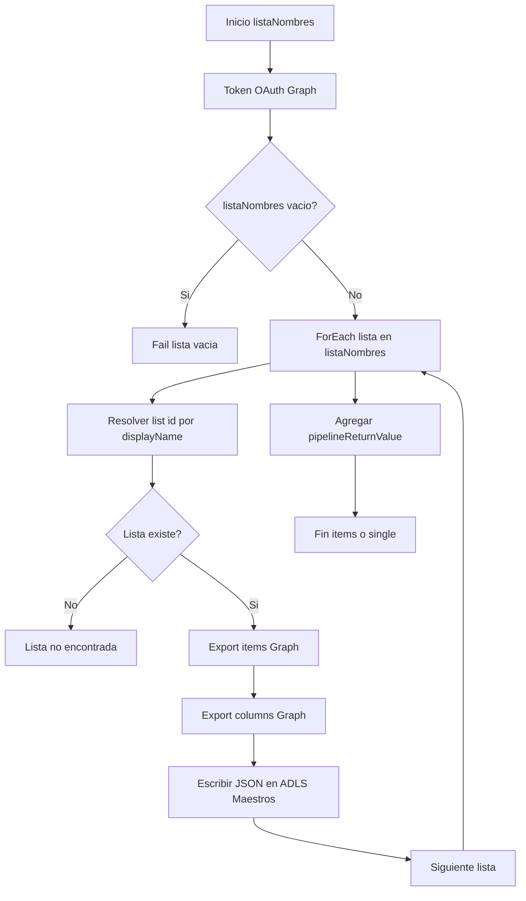

**Listas por defecto:** MaestroSociedades, MaestroProducto, MaestroTipoExpedicion, MaestroMoneda, MaestroLineaProductiva, MaestroJerarquia, MaestroDestino, MaestroCentroProductivo, MaestroCantera, MaestroAuxiliar1.

**Destino ADLS:** `refactoring-minerva-001/Maestros/{lista}/{lista}.json` y `{lista}_columns.json`.

---

### 7.4 — Trigger Databricks (`Databricks Job with Params`)

Artefacto: [`Databricks Job with Params_v2.json`](../Final_ADF_Pipelines/Orquestración/Databricks%20Job%20with%20Params_v2.json)

**Narrativa:** pipeline **genérico** invocado por `Load_Engine`. Registra la ejecución, obtiene token de Databricks y llama a la API `jobs/run-now` pasando el JSON construido por el orquestador. **No procesa los datos** — solo dispara el job; el detalle Bronze queda fuera de esta guía.

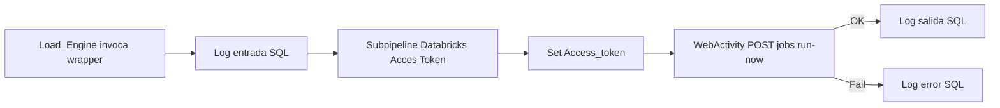

**Parámetros de entrada:**

| Parámetro | Origen | Descripción |
| --- | --- | --- |
| `Job` | `LoadEngineJobId` del main | ID numérico job Databricks |
| `PipelineOrigen` | Constante `MINERVA` | Trazabilidad |
| `Params` | `var_load_engine_params` | JSON string con filePath o items maestro |

**Fuera de alcance:** comportamiento interno del notebook/job Load Engine (Bronze).

---

## BLOQUE 8 — Matriz de parámetros E2E

| Origen (app) | Power Automate | ADF main | `var_load_engine_params` |
| --- | --- | --- | --- |
| `ddSociedad` | Ruta SP + HTTP (PLANTILLA) | `sociedad` | Incluido |
| `ddAno` | Idem | `ano` | Incluido |
| `ddMes` | Idem | `mes` | Incluido |
| `ddConcepto.IdPlantilla` | Ruta SP + HTTP | `concepto` | Incluido |
| `PROCESS`/`REPROCESS`/`DELETE` | HTTP | `accion` | `accion` |
| `PLANTILLA`/`MAESTRO` | `Condition_3` + HTTP | `origen` | `origen` |
| Nombre plantilla | Metadatos SP | — | — |
| `User().Email` | Metadatos SP | — | — |
| — | — | `listaNombres` (default) | MAESTRO |
| — | — | `catalog` (`dev`) | `catalog` |

### Ejemplo JSON — PLANTILLA → Databricks

```json
{
  "accion": "PROCESS",
  "filePath": "Plantillas/CMSA_PL_2026_06_ejemplo.xlsx",
  "catalog": "dev",
  "origen": "PLANTILLA",
  "sociedad": "CMSA",
  "ano": "2026",
  "mes": "06",
  "concepto": "PL"
}
```

### Ejemplo JSON — MAESTRO → Databricks

```json
{
  "origen": "MAESTRO",
  "catalog": "dev",
  "sourceFormat": "sharepoint_list_v3",
  "listaFolder": "Maestros/MaestroSociedades",
  "filePath": "Maestros/MaestroSociedades/MaestroSociedades.json",
  "schemaPath": "Maestros/MaestroSociedades/MaestroSociedades_columns.json",
  "listaNombre": "MaestroSociedades"
}
```

### Ejemplo recorrido — Procesar PL (narrativa completa)

1. **Usuario:** CMSA, 2026, 06, PL → **Procesar** en la [app UAT](https://apps.powerapps.com/play/e/default-495d03db-f910-4fcf-9e4c-2cab5fb10e56/a/219fddb2-851a-47b9-a4c7-92dce5697ced?tenantId=495d03db-f910-4fcf-9e4c-2cab5fb10e56).
2. **Power Automate:** valida Excel en [SharePoint de Carga](https://cemolins.sharepoint.com/sites/MinervaCdG2.0-Test/Documentos%20compartidos/Forms/AllItems.aspx), archiva en [Documentos Consolidados](https://cemolins.sharepoint.com/sites/MinervaCdG2.0-Test/Documentos%20Consolidados/Forms/Agrupado%20Periodo%20%20Area.aspx), HTTP `origen=PLANTILLA`, `accion=PROCESS`.
3. **ADF main:** ejecuta `minerva_sharepoint_to_blob` → blob `refactoring-minerva-001/Plantillas/CMSA_PL_2026_06_....xlsx`.
4. **ADF wrapper:** `Load_Engine` → job `1097709261114096` con JSON `filePath`, `catalog`, `origen`, periodo.
5. **App:** Notify verde con mensaje de Power Automate.

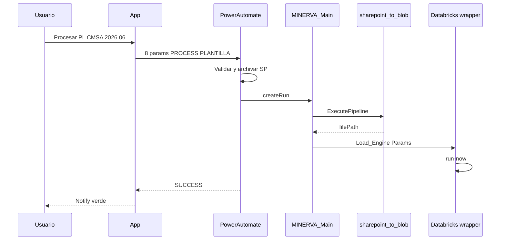

---

## BLOQUE 9 — Errores frecuentes y soporte

| Síntoma | Capa | Causa probable | Dónde mirar |
| --- | --- | --- | --- |
| Botón gris | App | Sin permiso | [Test2 / MinervaPermisos](https://cemolins.sharepoint.com/sites/MinervaCdG2.0-Test/Lists/Test2/AllItems.aspx) |
| *Debe informar todos los parámetros* | App | Dropdown vacío | Completar 4 selectores |
| *No se ha encontrado ningún fichero…* | PA | Carpeta SP vacía | [SharePoint de Carga](https://cemolins.sharepoint.com/sites/MinervaCdG2.0-Test/Documentos%20compartidos/Forms/AllItems.aspx) |
| *…más de un fichero…* | PA | Varios Excel | Dejar solo uno en carpeta |
| Notify error tras pulsar | PA | `status` ≠ SUCCESS | Run history Power Automate |
| `EMPTY_ORIGEN` | ADF | `origen` no llega | Body HTTP en PA |
| Ingesta OK, sin Databricks | ADF | Fallo Load_Engine | Monitor ADF |
| `SP_FILE_NOT_FOUND` | ADF plantillas | Sin `.xlsx` en ruta | SharePoint + parámetros periodo |
| Lista maestro no encontrada | ADF maestros | Nombre lista incorrecto | `listaNombres` default main |
| Job not found | Databricks wrapper | `LoadEngineJobId` incorrecto | Parámetro main pipeline |
| Actualizar Maestros sin feedback real | App + PA | Sin Respond en rama MAESTRO | BLOQUE 11 |

---

## BLOQUE 11 — Deuda técnica conocida

| Tema | Detalle |
| --- | --- |
| `Detalles_Ejecución` | Pantalla WIP con errores App Checker |
| Panel ejecución | Etiquetas estáticas; `btnRefreshExecution` incompleto |
| Bronze / notebooks | Fuera de alcance de esta guía |

---